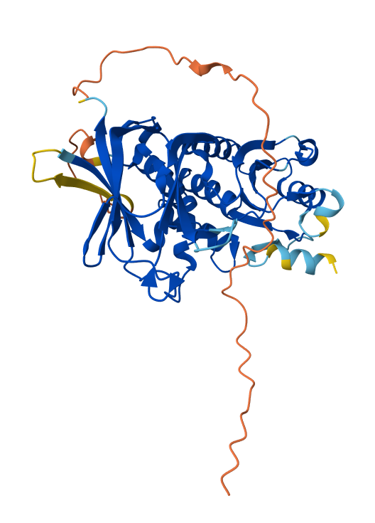
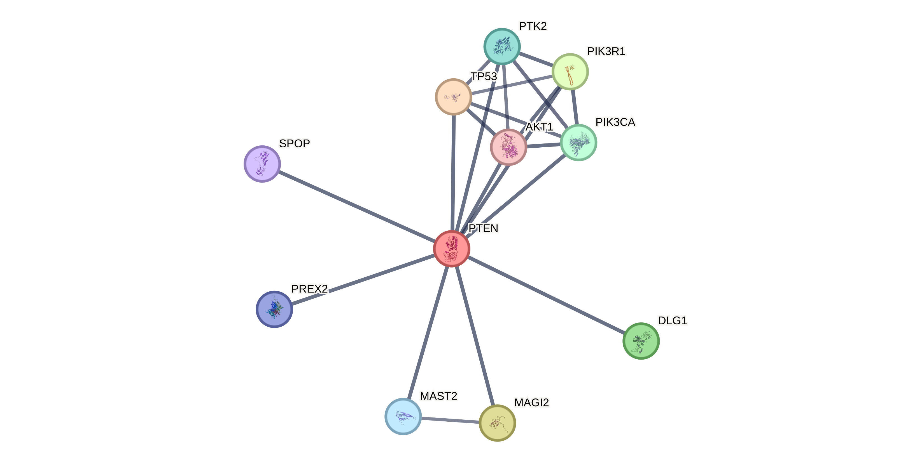
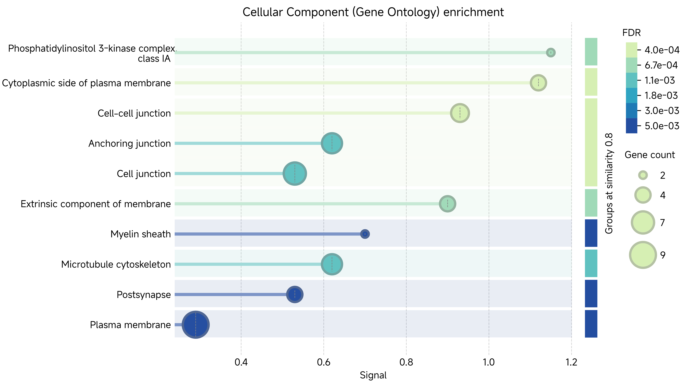
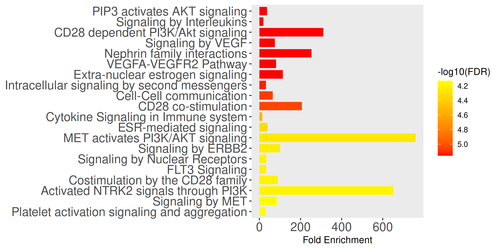
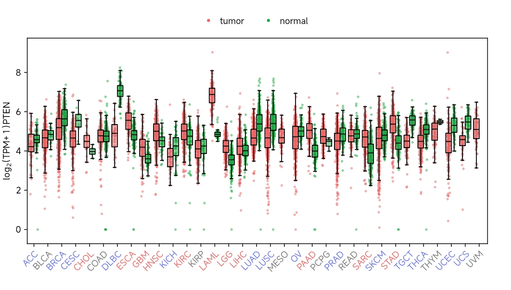
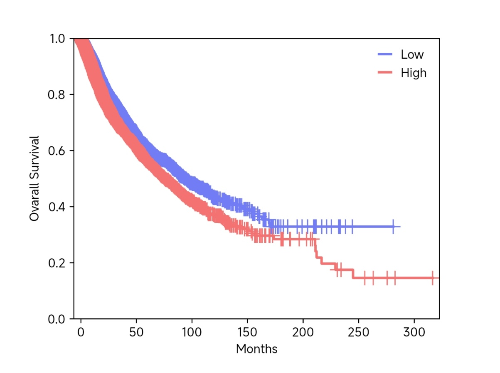
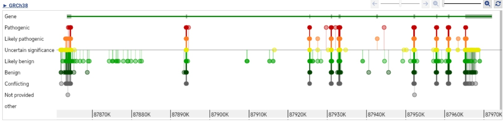

# Comprehensive Bioinformatics Analysis of the Human PTEN Gene and Protein

<p align="center">
  
</p>

---

## Project Overview

This repository presents a comprehensive **in silico bioinformatics analysis** of the human **PTEN (Phosphatase and Tensin Homolog)** gene and protein.

PTEN is one of the most important tumor suppressor genes involved in regulating cell proliferation, apoptosis, cell survival, genomic stability, and the PI3K/AKT signaling pathway. This project integrates multiple publicly available bioinformatics databases and computational tools to investigate PTEN gene annotation, sequence characteristics, protein structure, functional domains, molecular interactions, pathway enrichment, disease associations, and clinical significance.

---

# Bioinformatics Workflow

<p align="center">
  
</p>

**Figure 1.** Workflow employed for the comprehensive bioinformatics analysis of the human PTEN gene and protein.

---

# Gene Annotation

<p align="center">
  
</p>

**Figure 2.** PTEN gene annotation retrieved from the NCBI Gene database.

---

# Open Reading Frame (ORF) Analysis

<p align="center">
  
</p>

**Figure 3.** Open Reading Frame (ORF) analysis performed using NCBI ORF Finder.

---

# Protein Structure Prediction

<p align="center">
  
</p>

**Figure 4.** Three-dimensional structure prediction of the human PTEN protein generated using the AlphaFold Protein Structure Database.

---

# Protein–Protein Interaction Network

<p align="center">
  
</p>

**Figure 5.** Protein–protein interaction network of PTEN generated using the STRING database.

---

# Gene Ontology (GO) Enrichment Analysis

<p align="center">
  
</p>

**Figure 6.** Gene Ontology enrichment analysis illustrating enriched biological processes, molecular functions, and cellular components associated with PTEN.

---

# Pathway Enrichment Analysis

<p align="center">
  
</p>

**Figure 7.** Reactome pathway enrichment analysis highlighting major signaling pathways associated with PTEN.

---

# Gene Expression Analysis

<p align="center">
  
</p>

**Figure 8.** PTEN gene expression across multiple cancer types analyzed using GEPIA3.

---

# Survival Analysis

<p align="center">
  
</p>

**Figure 9.** Kaplan–Meier survival analysis illustrating the prognostic significance of PTEN expression.

---

# Disease-Associated Variants

<p align="center">
  
</p>

**Figure 10.** ClinVar visualization showing pathogenic and benign PTEN variants associated with human diseases.

---

# Bioinformatics Databases and Tools Used

- NCBI Gene
- NCBI RefSeq
- UniProt
- ORF Finder
- ExPASy ProtParam
- Conserved Domain Database (CDD)
- AlphaFold Protein Structure Database
- DSSP
- STRING
- ShinyGO
- Reactome
- OMIM
- ClinVar
- Therapeutic Target Database (TTD)
- GEPIA3

---

# Repository Structure

```
PTEN-Bioinformatics-Analysis
│
├── images
│   ├── repository_banner.png
│   ├── workflow.png
│   ├── gene_annotation.png
│   ├── ORF_analysis.png
│   ├── protein_structure.png
│   ├── PPI_network.png
│   ├── GO_enrichment.png
│   ├── pathway_analysis.png
│   ├── gene_expression.png
│   ├── survival_analysis.png
│   └── disease_association.png
│
├── README.md
└── LICENSE
```

---

# Key Objectives

- Retrieve PTEN gene and protein sequence information.
- Perform ORF identification and sequence characterization.
- Analyze physicochemical properties of the PTEN protein.
- Identify conserved functional domains.
- Predict and visualize the three-dimensional protein structure.
- Investigate protein–protein interaction networks.
- Perform Gene Ontology enrichment analysis.
- Explore biological pathways involving PTEN.
- Assess disease-associated variants.
- Evaluate PTEN gene expression and survival associations across cancers.

---

# References

- NCBI Gene Database
- UniProt Knowledgebase
- NCBI ORF Finder
- ExPASy ProtParam
- Conserved Domain Database (CDD)
- AlphaFold Protein Structure Database
- STRING Database
- ShinyGO
- Reactome Pathway Database
- OMIM
- ClinVar
- Therapeutic Target Database (TTD)
- GEPIA3

---

# Author

**Soumojit Ghosh**

B.Sc. Biotechnology  
St. Xavier's College, Burdwan

GitHub: https://github.com/soumojitghosh3706-source

---

# License

This project is licensed under the MIT License.
