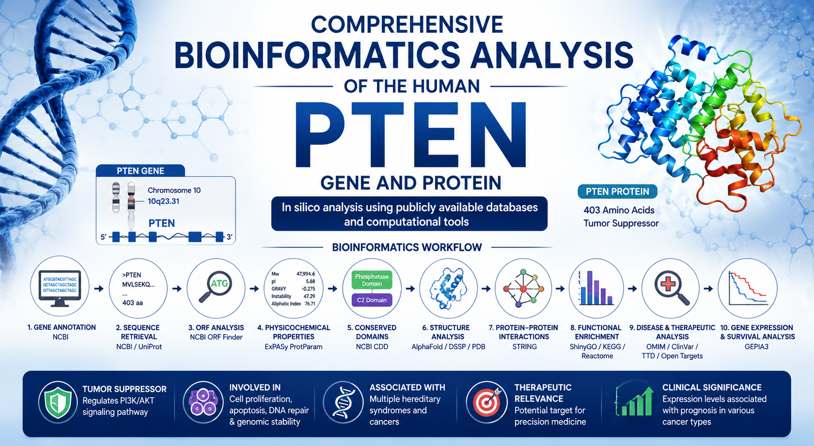
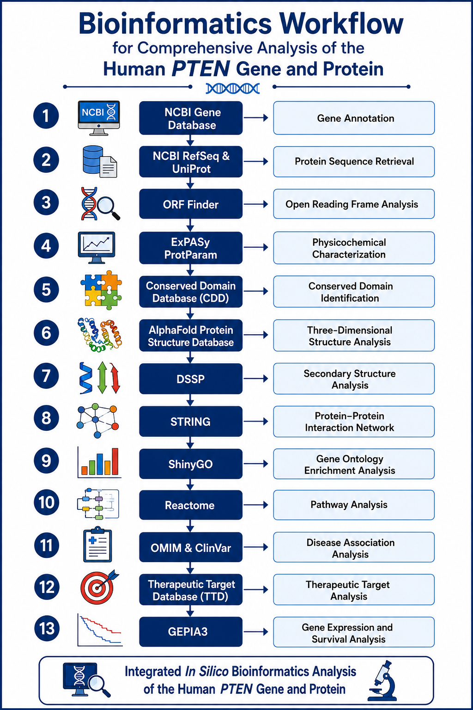
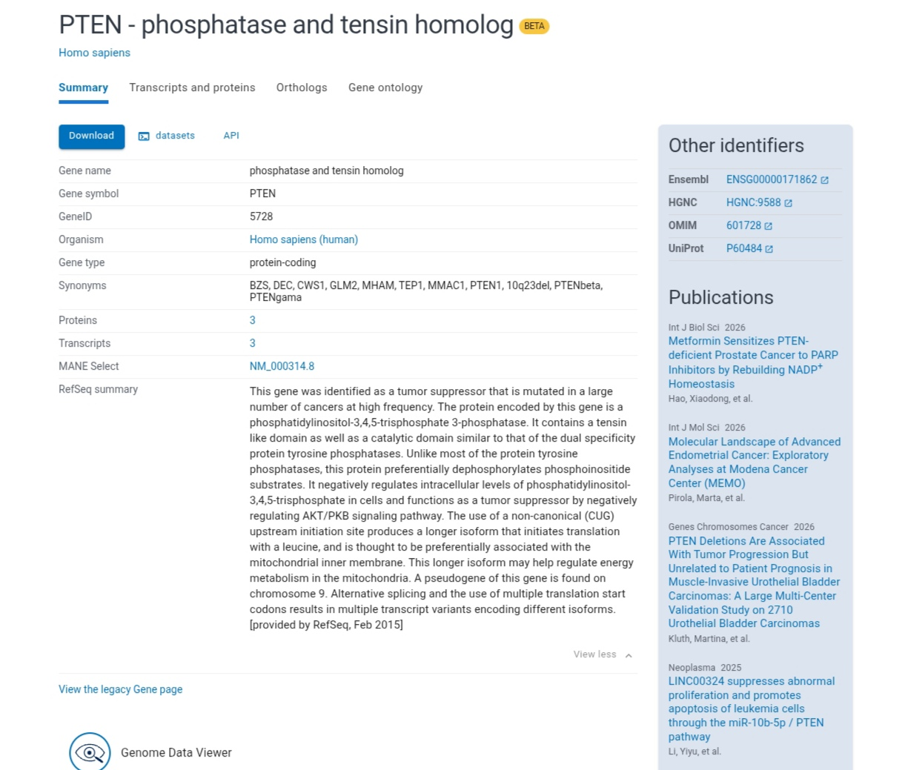
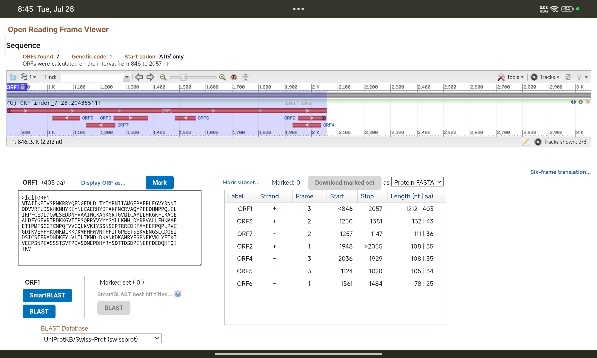

# Comprehensive Bioinformatics Analysis of the Human PTEN Gene and Protein

  

## Project Overview

This project presents a comprehensive in silico bioinformatics analysis of the human **PTEN (Phosphatase and Tensin Homolog)** gene and protein. PTEN is one of the most important tumor suppressor genes involved in regulating cell proliferation, apoptosis, cell survival, and the PI3K/AKT signaling pathway.

The study integrates multiple publicly available bioinformatics databases and computational tools to investigate PTEN gene annotation, protein characteristics, structural organization, functional interactions, pathway enrichment, disease association, and clinical significance.

---

## Bioinformatics Workflow

  

**Figure 1.** Workflow used for the comprehensive bioinformatics analysis of the human PTEN gene and protein.

---

## Gene Annotation

  

**Figure 2.** PTEN gene annotation retrieved from the NCBI Gene database.

---

## Open Reading Frame (ORF) Analysis

  

**Figure 3.** Open Reading Frame (ORF) analysis performed using NCBI ORF Finder.
